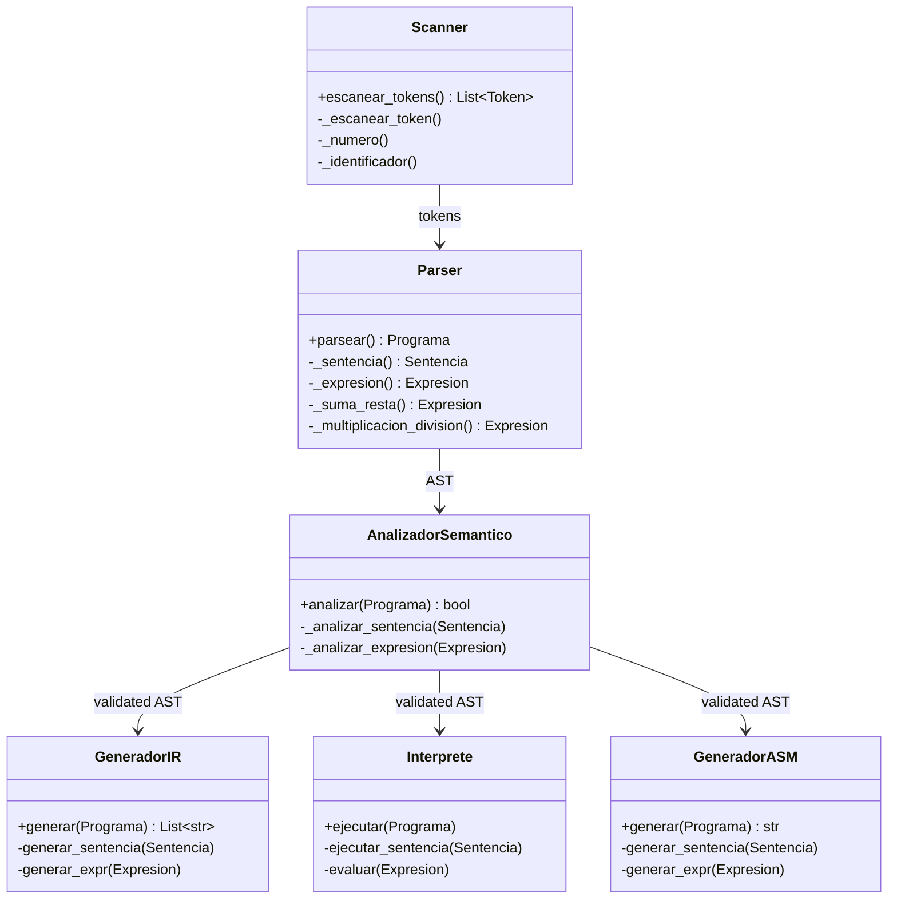

## Overview

The Mini-Compilador Educativo follows a classic multi-phase compiler architecture, transforming high-level source code through six distinct stages into executable x86 assembly code. Each phase is encapsulated in its own class, creating a modular and maintainable design.


## Architecture Diagram

```
┌──────────────────────────────────────────────────────────────┐
│                      Source Code                              │
│                  "let x = 5 + 3;"                            │
└────────────────────┬─────────────────────────────────────────┘
                     │
                     ▼
         ┌───────────────────────┐
         │   1. Scanner (Lexer)  │  Character stream → Tokens
         │   TipoToken, Token    │  [LET, ID(x), =, NUM(5), +, NUM(3), ;]
         └───────────┬───────────┘
                     │
                     ▼
         ┌───────────────────────┐
         │   2. Parser           │  Tokens → AST
         │   Recursive Descent   │  DeclaracionVariable(x, BinExpr(+, 5, 3))
         └───────────┬───────────┘
                     │
                     ▼
         ┌───────────────────────┐
         │ 3. SemanticAnalyzer   │  Validates AST semantics
         │   Variable tracking   │  Checks: undeclared vars, div by zero
         └───────────┬───────────┘
                     │
                     ▼
         ┌───────────────────────┐
         │ 4. GeneradorIR        │  AST → Three Address Code
         │   TAC generation      │  t0 = 5 + 3
         └───────────┬───────────┘  x = t0
                     │
                     ├─────────────────────┐
                     │                     │
                     ▼                     ▼
         ┌───────────────────┐  ┌─────────────────────┐
         │ 5. Interprete     │  │ 6. GeneradorASM     │
         │   Executes AST    │  │   TAC → x86 ASM     │
         │   Runtime eval    │  │   EMU8086 format    │
         └───────────────────┘  └─────────────────────┘
```

## Core Components

### Phase 1: Scanner (Lexical Analysis)

**Class:** `Scanner`  
**Input:** Raw source code string  
**Output:** List of `Token` objects

<CodeGroup>
```python Token Structure
@dataclass
class Token:
    tipo: TipoToken        # Token type (LET, NUMERO, etc.)
    lexema: str            # Original text ("let", "42", etc.)
    linea: int             # Line number
    columna: int           # Column position
    valor: Any = None      # Numeric value for NUMERO tokens
```

```python Token Types
class TipoToken(Enum):
    # Keywords
    LET = auto()           # Variable declaration
    PRINT = auto()         # Print statement
    LEO = auto()           # Reserved (no-op)
    DIEGO = auto()         # Reserved (no-op)
    
    # Literals
    NUMERO = auto()        # Integer literals
    IDENTIFICADOR = auto() # Variable names
    
    # Operators
    SUMA = auto()          # +
    RESTA = auto()         # -
    MULTIPLICACION = auto() # *
    DIVISION = auto()      # /
    IGUAL = auto()         # =
    
    # Delimiters
    PAREN_IZQ = auto()     # (
    PAREN_DER = auto()     # )
    PUNTO_COMA = auto()    # ;
```
</CodeGroup>

**Key Features:**
- Character-by-character scanning with position tracking
- Comment handling (`//` single-line comments)
- Reserved word dictionary lookup
- Error collection with line/column information

**Source:** `compfinal.py:207-491`

### Phase 2: Parser (Syntactic Analysis)

**Class:** `Parser`  
**Input:** List of tokens from Scanner  
**Output:** Abstract Syntax Tree (AST) as `Programa` object

<AccordionGroup>
  <Accordion title="AST Node Types">
    **Expressions** (produce values):
    - `NumeroLiteral` - Integer constants
    - `Identificador` - Variable references
    - `ExpresionBinaria` - Binary operations (+, -, *, /)
    - `ExpresionAgrupada` - Parenthesized expressions

    **Statements** (perform actions):
    - `DeclaracionVariable` - Variable assignments
    - `SentenciaPrint` - Print statements

    **Root Node:**
    - `Programa` - Container for all statements
  </Accordion>
</AccordionGroup>

**Parsing Strategy:**  
Recursive descent with operator precedence handling:

```python
expresion → suma_resta
suma_resta → mult_div (('+' | '-') mult_div)*
mult_div → primario (('*' | '/') primario)*
primario → NUMERO | IDENTIFICADOR | '(' expresion ')'
```

The nesting ensures multiplication/division bind tighter than addition/subtraction.

**Example AST:**
```
Programa
└── DeclaracionVariable
    ├── nombre: 'x'
    └── valor:
        └── ExpresionBinaria
            ├── operador: '+'
            ├── izquierda: NumeroLiteral(5)
            └── derecha: NumeroLiteral(3)
```

**Source:** `compfinal.py:653-950`

### Phase 3: Semantic Analyzer

**Class:** `AnalizadorSemantico`  
**Input:** AST from Parser  
**Output:** Boolean success + error list

<CardGroup cols={2}>
  <Card title="Variable Tracking" icon="check-circle">
    Maintains a set of declared variables. Detects use of undeclared identifiers.
  </Card>
  <Card title="Division by Zero" icon="exclamation-triangle">
    Catches literal division by zero (e.g., `x / 0`) at compile time.
  </Card>
</CardGroup>

**Validation Rules:**
1. Variables must be declared before use
2. No division by zero with numeric literals
3. Warns on variable redeclaration

**Implementation:** Visitor pattern recursively traversing the AST.

**Source:** `compfinal.py:968-1085`

### Phase 4: Intermediate Code Generator

**Class:** `GeneradorIR`  
**Input:** Validated AST  
**Output:** Three Address Code (TAC) as list of strings

**TAC Format:**
```
t0 = 5 + 3
x = t0
print x
```

**Characteristics:**
- Each instruction has at most one operator
- Temporary variables (`t0`, `t1`, ...) hold intermediate results
- Platform-independent representation
- Suitable for optimization passes

**Source:** `compfinal.py:1090-1149`

### Phase 5: Interpreter

**Class:** `Interprete`  
**Input:** AST  
**Output:** Runtime execution results

<Note>
The interpreter executes the program by evaluating the AST directly, providing immediate feedback without requiring assembly or machine code generation.
</Note>

**Features:**
- Variable storage in dictionary
- Direct expression evaluation
- Integer arithmetic (using floor division for `/`)
- Print output to console

**Source:** `compfinal.py:1156-1215`

### Phase 6: Assembly Code Generator

**Class:** `GeneradorASM`  
**Input:** AST  
**Output:** x86 assembly code string (EMU8086 format)

**Generated Structure:**
```asm
.model small
.stack 100h

.data
    x dw 0          ; Variable declarations
    msg db 13,10,'$'

.code
main proc
    mov ax, @data
    mov ds, ax
    
    ; Generated instructions
    mov ax, 5
    push ax
    mov ax, 3
    mov bx, ax
    pop ax
    add ax, bx      ; Result in AX
    mov x, ax       ; Store to variable
    
    mov ah, 4ch
    int 21h
main endp

; print_num procedure...
end main
```

**Key Techniques:**
- Stack-based evaluation of expressions
- `AX` register for accumulator
- `BX` register for right operand
- Included `print_num` routine for output

**Source:** `compfinal.py:1221-1390`

## Data Flow

Here's how a simple program flows through the compiler:

<Steps>
  <Step title="Input Code">
    ```
    let result = 10 + 5 * 2;
    print result;
    ```
  </Step>
  
  <Step title="After Lexer">
    ```
    [LET, ID(result), =, NUM(10), +, NUM(5), *, NUM(2), ;, PRINT, ID(result), ;, EOF]
    ```
  </Step>
  
  <Step title="After Parser">
    ```
    Programa[
      DeclaracionVariable(result, BinExpr(+, 10, BinExpr(*, 5, 2))),
      SentenciaPrint(ID(result))
    ]
    ```
  </Step>
  
  <Step title="After Semantic Analysis">
    ✓ All variables declared  
    ✓ No division by zero
  </Step>
  
  <Step title="After IR Generation">
    ```
    t0 = 5 * 2
    t1 = 10 + t0
    result = t1
    print result
    ```
  </Step>
  
  <Step title="After Interpreter">
    Console output: `20`
  </Step>
  
  <Step title="After ASM Generation">
    Produces `.asm` file ready for EMU8086
  </Step>
</Steps>

## Error Handling Strategy

<Tabs>
  <Tab title="Lexical Errors">
    Collected in `Scanner.errores` list:
    - Invalid characters
    - Reported with line/column
    - Compilation halts if errors present
  </Tab>
  
  <Tab title="Syntax Errors">
    Handled in `Parser` with error recovery:
    - Uses synchronization points (`;` and statement keywords)
    - Allows multiple error reporting
    - Continues parsing after errors when possible
  </Tab>
  
  <Tab title="Semantic Errors">
    Tracked in `AnalizadorSemantico.errores`:
    - Undeclared variables
    - Division by zero (literals only)
    - Warnings for redeclarations
  </Tab>
</Tabs>

## Class Relationships



## Key Design Principles

<CardGroup cols={2}>
  <Card title="Separation of Concerns" icon="layer-group">
    Each phase handles one responsibility, making the codebase easy to understand and extend.
  </Card>
  
  <Card title="Visitor Pattern" icon="route">
    AST traversal uses implicit visitor pattern through type checking with `isinstance()`.
  </Card>
  
  <Card title="Error Recovery" icon="shield-alt">
    Parser synchronization allows reporting multiple errors in one pass.
  </Card>
  
  <Card title="Immutable AST" icon="lock">
    AST nodes use `@dataclass` for clean, immutable structures.
  </Card>
</CardGroup>

<Warning>
The compiler currently has no optimization phase. The IR is generated but not optimized before assembly generation. This is a potential area for future enhancement.
</Warning>